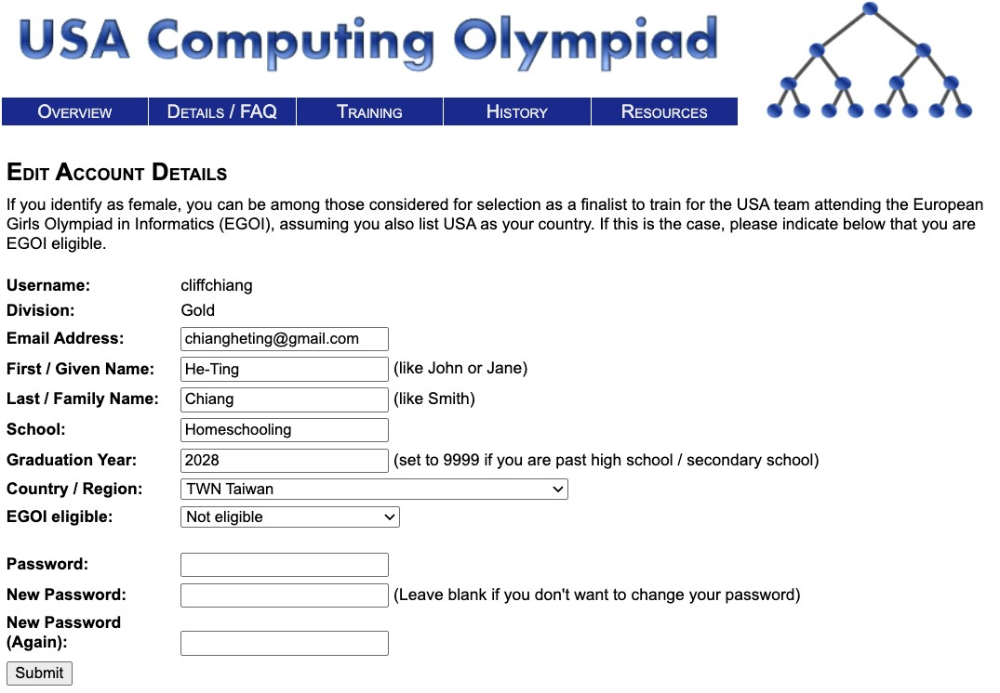
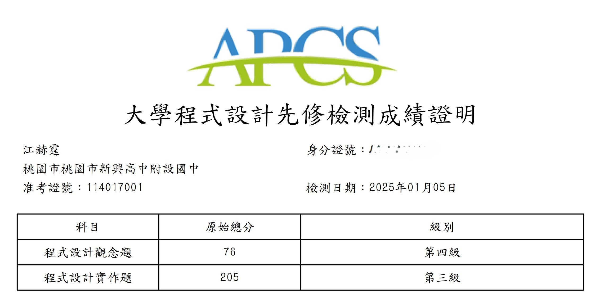
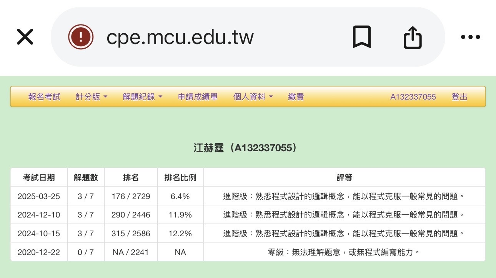
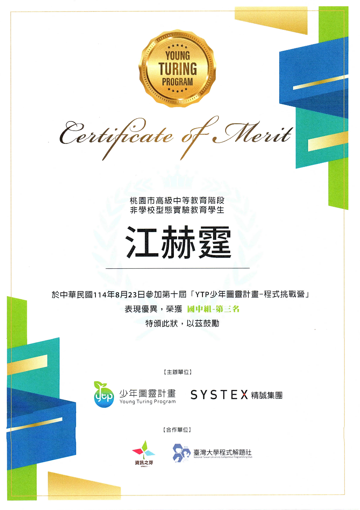
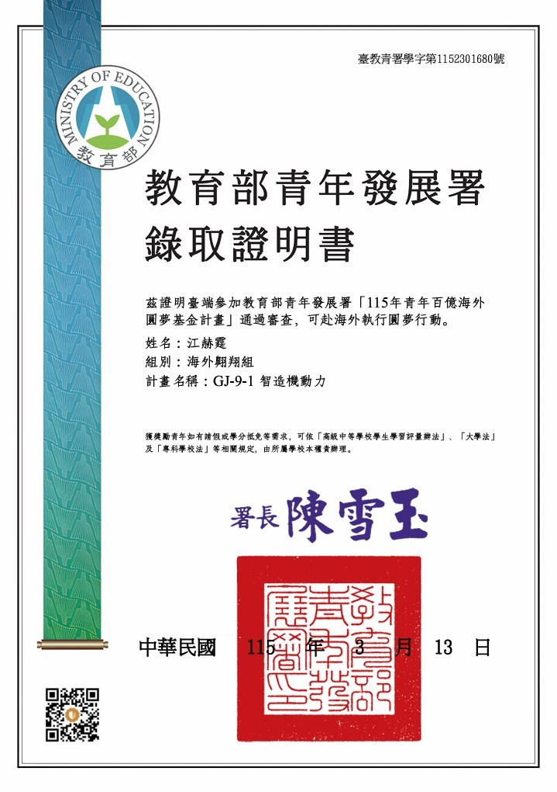

# IT比賽與活動

## USACO Gold

- Bronze Full Score
- Silver Full Score

 

---

## APCS 與 CPE

- APCS 7級分（觀念4、實作3）

 

---

## CPE 解題3題，排名前6.4%

 

---

## 第十屆 YTP 少年圖靈計畫程式挑戰營  國中組第三名
 
 

---

##### 通過「115年青年百億海外圓夢基金計畫」審查，錄取海外翱翔組
- 主辦單位 : 教育部青年發展署
- 通過教育部青年發展署「115年青年百億海外圓夢基金計畫」審查，錄取參與海外翱翔組「GJ-9-1 智造機動力」計畫。
- 由教育部透過公開甄選方式遴選具潛力青年參與國際交流與海外實踐活動。藉由海外參訪、跨國學習與專題實作，培養國際視野、創新能力及跨文化合作能力，並將所學成果應用於未來學術與職涯發展。

 

#  [回到主頁](index.md)