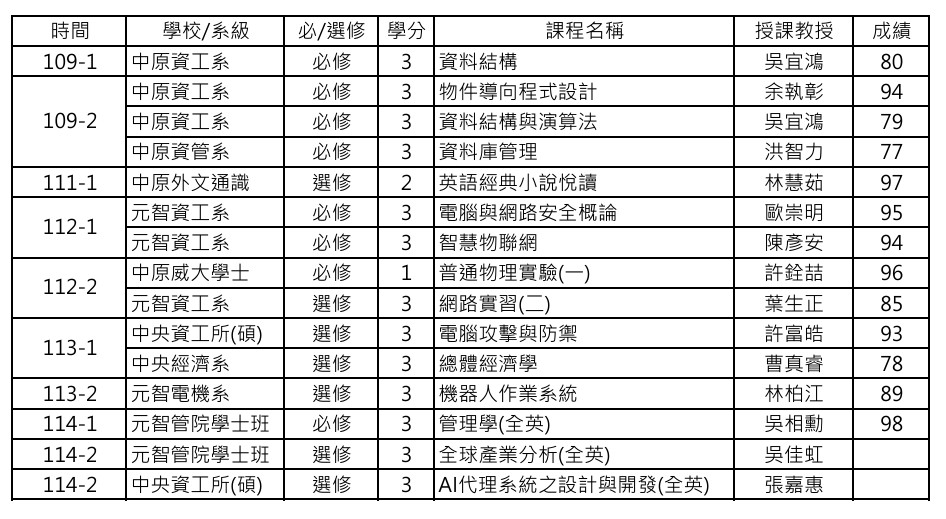

# 大學修課

我從小學五年級開始透過桃園市教育局的大學媒合計畫，推薦到中原、元智和中央大學，共修習並取得33學分課程。

<!--- [Data Structures 資料結構](#data%20structures%20資料結構)-->

## 課程目錄

<!--
- [[#Data Structures 資料結構]]
- [[#Data Structures and Algorithms (資料結構與演算法)]]
- [[#Object-Oriented Programming (物件導向程式設計)]]
- [[#Database Management (資料庫管理)]]
- [[#Introduction to Computer and Network Security (電腦與網路安全概論)]]
- [[#Artificial Intelligence of Things (智慧物聯網)]]
- [[#Network Lab (II) (網路實習（二）)]]
- [[#Robot Operating System (ROS) (機器人作業系統)]]
- [[#The Attack and Defense of Computers (電腦攻擊與防禦)]]
- [[#Agentic AI: Foundations and Development (AI代理系統之設計與開發)]]
- [[#Macroeconomics (總體經濟學)]]
- [[#Management (管理學)]]
- [[#Global Industrial Analysis (全球產業分析)]]
- [[#Reading English Classic Novels (英語經典小說悅讀)]]
- [[#General Physics Laboratory I (普通物理實驗（一）)]] -->

- [Data Structures 資料結構](#data-structures-資料結構)
- [Data Structures and Algorithms 資料結構與演算法](#data-structures-and-algorithms-資料結構與演算法)
- [Object-Oriented Programming 物件導向程式設計](#object-oriented-programming-物件導向程式設計)
- [Database Management 資料庫管理](#database-management-資料庫管理)
- [Introduction to Computer and Network Security 電腦與網路安全概論](#introduction-to-computer-and-network-security-電腦與網路安全概論)
- [Artificial Intelligence of Things 智慧物聯網](#artificial-intelligence-of-things-智慧物聯網)
- [Network Lab II 網路實習（二）](#network-lab-ii-網路實習二)
- [Robot Operating System 機器人作業系統](#robot-operating-system-ros-機器人作業系統)
- [The Attack and Defense of Computers 電腦攻擊與防禦](#the-attack-and-defense-of-computers-電腦攻擊與防禦)
- [Agentic AI: Foundations and Development AI代理系統之設計與開發](#agentic-ai-foundations-and-development-ai代理系統之設計與開發)
- [Macroeconomics 總體經濟學](#macroeconomics-總體經濟學)
- [Management 管理學](#management-管理學)
- [Global Industrial Analysis 全球產業分析](#global-industrial-analysis-全球產業分析)
- [Reading English Classic Novels 英語經典小說悅讀](#reading-english-classic-novels-英語經典小說悅讀)
- [General Physics Laboratory I 普通物理實驗（一）](#general-physics-laboratory-i-普通物理實驗一)

<!-- ![[照片/修課學分2026.jpg|500]] -->

 
 

## Data Structures 資料結構   

<!--  [ Course syllabus](大學修課/1091_CS103E_81140.pdf)  -->
- University: Chung Yuan Christian University (CYCU)
- Course Code: CS103E
- Instructor: Prof. Yi-Hung Wu 吳宜鴻 教授
- Credits: 3
- Type: Required Course
- Semester: Fall 2020 (109-1)

#### Course Summary   [syllabus button](大學修課/1091_CS103E_81140.pdf)
Studied fundamental data structures and algorithm design using C/C++. Topics included Recursion, Abstract Data Types (ADT), Linked Lists, Stacks, Queues, Sorting Algorithms, Binary Trees, Binary Search Trees (BST), Priority Queues, Heaps, and Big-O Analysis. Completed multiple programming assignments and practical coding assessments.

#### Keywords
Recursion, ADT, Linked List, Stack, Queue, Big-O Notation, Sorting, Binary Tree, BST, Priority Queue, Heap, C++  

<!-- [[#課程目錄]] -->
[課程目錄](#課程目錄)

## Data Structures and Algorithms (資料結構與演算法)

- University: Chung Yuan Christian University (CYCU)
- Course Code: CS116D
- Instructor: Prof. Yi-Hung Wu
- Credits: 3
- Type: Required Course
- Semester: Spring 2021 (109-2)

##### Course Summary
Studied advanced data structures and algorithm design techniques, including balanced search trees (AVL Trees, Red-Black Trees), Hash Tables, Graph Algorithms, Priority Queues, Heaps, Minimum Spanning Trees, Shortest Path Algorithms, Maximum Flow, External Sorting, and B-Tree Indexing. Implemented core data structures and algorithms in C/C++ through practical programming assignments and coding assessments.

### Keywords
Priority Queue, Heap, AVL Tree, Red-Black Tree, Hashing, Graph Theory, BFS, DFS, Topological Sort, MST, Dijkstra, Maximum Flow, External Sorting, B-Tree, Algorithm Analysis, C++

[Data Structures and Algorithms Syllabus](大學修課/1092_CS116D_99101.pdf)

<!-- [[#課程目錄]] -->
[課程目錄](#課程目錄)

## Object-Oriented Programming (物件導向程式設計)

- University: Chung Yuan Christian University (CYCU)
- Course Code: CS118D
- Instructor: Prof. Chih-Chang Yu
- Credits: 3
- Type: Required Course
- Semester: Spring 2021 (109-2)

### Course Summary
Studied Object-Oriented Programming (OOP) principles and software design using Java. Explored the four core OOP concepts—Abstraction, Encapsulation, Inheritance, and Polymorphism—and applied them to software analysis, design, and implementation. Developed Java applications while learning UML modeling, Interfaces, Exception Handling, Collections Framework, Generics, Design Patterns, SOLID Principles, Refactoring, Multithreading, and GUI development. 

### Keywords
Object-Oriented Programming (OOP), Java, Abstraction, Encapsulation, Inheritance, Polymorphism, UML, Interface, Exception Handling, Collections Framework, Generics, Design Patterns, SOLID Principles, Refactoring, Multithreading, GUI Development

[Object-Oriented Programming Syllabus](大學修課/1092_CS118D_30872物件導向程式設計.pdf)

<!-- [[#課程目錄]] -->
[課程目錄](#課程目錄)

## Database Management (資料庫管理)

- University: Chung Yuan Christian University (CYCU)
- Course Code: MI237E
- Instructor: Prof. Chih-Li Hung
- Credits: 3
- Type: Required Course
- Semester: Spring 2021 (109-2)

### Course Summary
Studied database management systems (DBMS), database design, and application development. Topics included relational database modeling, normalization, Entity-Relationship (ER) modeling, SQL programming, database implementation, triggers, stored procedures, database security, transaction logging, and distributed database systems. Designed and implemented a database application prototype as a semester project.

### Keywords
DBMS, SQL, Database Design, Relational Model, Normalization, ER Model, Data Modeling, Trigger, Stored Procedure, Transaction Management, Database Security, Distributed Database, Database Application Development, Database Implementation, Data Integrity

[Database Management Syllabus](大學修課/1092_MI237E_62320資料庫管理.pdf)

<!-- [[#課程目錄]] -->
[課程目錄](#課程目錄)

## Introduction to Computer and Network Security (電腦與網路安全概論)

- University: Yuan Ze University (YZU)
- Course Code: CS354A
- Instructor: Prof. Chung-Ming Ou
- Credits: 3
- Type: Undergraduate Course
- Semester: Fall 2023 (112-1)

### Course Summary
Studied the fundamental concepts, principles, and technologies of computer and network security. Topics included cryptography, authentication, access control, database security, data center security, malware analysis, denial-of-service (DoS) attacks, intrusion detection systems (IDS), firewalls, intrusion prevention systems (IPS), buffer overflow vulnerabilities, software security, operating system security, cloud security, IoT security, risk assessment, security auditing, public-key cryptography, message authentication, internet security protocols, and wireless network security. 

### Keywords
Cryptography, Network Security, Authentication, Access Control, Database Security, Malware Analysis, DoS Attacks, Intrusion Detection System (IDS), Firewall, Intrusion Prevention System (IPS), Buffer Overflow, Software Security, Operating System Security, Cloud Security, IoT Security, Risk Assessment, Security Auditing, Public-Key Cryptography, Internet Security Protocols, Wireless Security

[Introduction to Computer and Network Security Syllabus](https://portalfun.yzu.edu.tw/cosSelect/Cos_Plan.aspx?y=112&s=1&id=CS354&c=A)

<!-- [[#課程目錄]] -->
[課程目錄](#課程目錄)

## Artificial Intelligence of Things (智慧物聯網)

- University: Yuan Ze University (YZU)
- Course Code: CS349A
- Instructor: Prof. Yen-An Chen
- Credits: 3
- Type: Undergraduate Course
- Semester: Fall 2023 (112-1)

### Course Summary
Studied the integration of Artificial Intelligence (AI) and Internet of Things (IoT) technologies through hands-on projects and laboratory experiments. Topics included Raspberry Pi development, Python programming, GPIO control, UART, I2C, SPI communication, sensor integration, actuator control, cloud platform integration, computer vision, object recognition, wireless communication, embedded systems, and AIoT application development. Completed a project-based system integrating virtual computing with real-world sensing and control. 

### Keywords
AIoT, Internet of Things (IoT), Raspberry Pi, Python, GPIO, UART, I2C, SPI, Sensor Integration, Actuator Control, Cloud Computing, Computer Vision, Object Detection, Wireless Communication, Embedded Systems, Smart Speaker, Bluetooth Beacon, Edge Computing, AI Applications, Project-Based Learning

[Artificial Intelligence of Things Syllabus](https://portalfun.yzu.edu.tw/cosSelect/Cos_Plan.aspx?y=112&s=1&id=CS349&c=A)

<!-- [[#課程目錄]] -->
[課程目錄](#課程目錄)

## Network Lab (II) (網路實習（二）)

- University: Yuan Ze University (YZU)
- Course Code: CS424A
- Instructor: Prof. Sheng-Cheng Yeh
- Credits: 3
- Type: Undergraduate Laboratory Course
- Semester: Spring 2024 (112-2)

### Course Summary
Developed practical networking skills through hands-on Cisco networking laboratories and CCNA-based training. Topics included LAN design, switching technologies, VLANs, VLAN Trunking Protocol (VTP), Spanning Tree Protocol (STP), Inter-VLAN Routing, Wireless LAN (WLAN) configuration, Point-to-Point Protocol (PPP), OSPF routing, Access Control Lists (ACLs), IP addressing services, network troubleshooting, and network security. Completed practical networking exercises, case studies, and CCNA laboratory assessments. 

### Keywords
LAN Design, Switching, VLAN, VTP, STP, Inter-VLAN Routing, WLAN, PPP, OSPF, ACL, IP Addressing, Network Troubleshooting, Network Security, Cisco Networking, CCNA

[Network Lab (II) Syllabus](https://portalfun.yzu.edu.tw/cosSelect/Cos_Plan.aspx?y=112&s=2&id=CS424&c=A)

<!-- [[#課程目錄]] -->
[課程目錄](#課程目錄)

## Robot Operating System (ROS) (機器人作業系統)

- University: Yuan Ze University (YZU)
- Course Code: EEB335A
- Instructor: Prof. Po-Chiang Lin
- Credits: 3
- Type: Undergraduate Course
- Semester: Spring 2025 (113-2)

### Course Summary
Studied Robot Operating System (ROS) as a framework for developing intelligent robotic applications. Topics included ROS architecture, installation and configuration, ROS tools and commands, simultaneous localization and mapping (SLAM), robot navigation, robot communication using Topics, Services, and Actions in both Python and C++, robot 3D modeling, and ROS-based simulation. Developed robotic applications and completed a final robotics project integrating software, communication, and simulation technologies. 

### Keywords
ROS, Robotics, Robot Operating System, SLAM, Navigation, Topic, Service, Action, Python, C++, Robot Communication, ROS Tools, Robot Simulation, 3D Robot Modeling, Autonomous Systems

[Robot Operating System Syllabus](https://portalfun.yzu.edu.tw/cosSelect/Cos_Plan.aspx?y=113&s=2&id=EEB335&c=A)

<!-- [[#課程目錄]] -->
[課程目錄](#課程目錄)

## The Attack and Defense of Computers (電腦攻擊與防禦)

- University: National Central University (NCU)
- Course Code: CE6107
- Instructor: Prof. Fu-Hao Hsu
- Credits: 3
- Type: Graduate-Level Course (Master/PhD)
- Semester: Fall 2024 (113-1)

### Course Summary
Studied advanced cybersecurity attack techniques and defense mechanisms through hands-on laboratories and security projects. Topics included malware analysis, Trojan Horses, Spyware, Rootkits, Backdoors, Keyloggers, Internet Worms, Buffer Overflow, Return-to-libc Attacks, Return-Oriented Programming (ROP), Fileless Malware, Cross-Site Scripting (XSS), Cross-Site Request Forgery (CSRF), SQL Injection, Format String Vulnerabilities, Integer Overflow, Denial-of-Service (DoS/DDoS) Attacks, and Botnet Operations. Applied offensive security concepts to understand real-world threats and corresponding defense strategies. :contentReference[oaicite:0]{index=0}

### Keywords
Malware Analysis, Trojan Horse, Spyware, Rootkit, Backdoor, Keylogger, Internet Worm, Buffer Overflow, Return-to-libc, ROP, Fileless Malware, XSS, CSRF, SQL Injection, Format String Vulnerability, Integer Overflow, DoS, DDoS, Botnet, Cyber Defense

[The Attack and Defense of Computers Syllabus](https://cis.ncu.edu.tw/Course/main/query/byKeywords?serialNo=52042&outline=52042&semester=1131)

<!-- [[#課程目錄]] -->
[課程目錄](#課程目錄)

## Agentic AI: Foundations and Development (AI代理系統之設計與開發)

- University: National Central University (NCU)
- Course Code: CE8014
- Instructor: Prof. Chia-Hui Chang
- Credits: 3
- Type: Graduate-Level Course (Master/PhD)
- Semester: Spring 2026 (114-2)

### Course Summary
Studied the foundations, architecture, and development of Agentic AI systems capable of autonomous decision-making and task execution. Topics included AI Agents, Large Language Models (LLMs), autonomous reasoning, planning, knowledge representation, human-AI interaction, AI safety, ethical AI design, performance evaluation, and real-world agent deployment. Applied modern agent frameworks and development tools to design, implement, and evaluate intelligent autonomous systems in complex environments. 

### Keywords
Agentic AI, AI Agents, Large Language Models (LLMs), Autonomous Agents, Reasoning, Planning, Knowledge Representation, Human-AI Interaction, AI Safety, AI Ethics, Decision Making, Agent Frameworks, Autonomous Systems, Multi-Agent Systems, Generative AI

[ Agentic AI: Foundations and Development Syllabus](https://cis.ncu.edu.tw/Course/main/query/byKeywords?serialNo=52058&outline=52058&semester=1142)

<!-- [[#課程目錄]] -->
[課程目錄](#課程目錄)

## Macroeconomics (總體經濟學)

- University: National Central University (NCU)
- Course Code: EC2005
- Instructor: Prof. Chen-Jui Tsao
- Credits: 3
- Type: Undergraduate Course
- Semester: Fall 2024 (113-1)

### Course Summary
Studied fundamental macroeconomic theories and their applications to real-world economic issues. Topics included GDP and National Income Accounting, Monetary Systems, Inflation, Open Economy Macroeconomics, Unemployment, Economic Growth, Business Cycles, Aggregate Demand, and Macroeconomic Policy Analysis. The course also examined Taiwan’s economic indicators and policy impacts, including wage growth, unemployment, money supply, inflation, and economic development. 

### Keywords
GDP, National Income, Monetary System, Inflation, Open Economy, Unemployment, Labor Market, Economic Growth, Business Cycle, Aggregate Demand, Aggregate Supply, Fiscal Policy, Monetary Policy, Economic Development, Macroeconomic Analysis

[Macroeconomics Syllabus](https://cis.ncu.edu.tw/Course/main/query/byKeywords?serialNo=44002&outline=44002&semester=1131)

<!-- [[#課程目錄]] -->
[課程目錄](#課程目錄)

## Management (管理學)

- University: Yuan Ze University (YZU)
- Course Code: CM108G
- Instructor: Prof. Hsiang-Hsun Wu
- Credits: 3
- Type: AACSB Course
- Semester: Fall 2025 (114-1)

### Course Summary
Studied fundamental management principles through case-based learning and business analysis. Explored strategic planning, leadership, organizational culture, innovation management, marketing strategy, supply chain management, crisis management, mergers and acquisitions (M&A), business models, and competitive strategy. Applied management theories to real-world business cases and developed systematic problem-solving and decision-making skills.

### Keywords
Management, Strategic Planning, Leadership, Organizational Culture, Innovation Management, Marketing Strategy, Supply Chain Management, Crisis Management, Business Model, Competitive Strategy, Mergers and Acquisitions (M&A), Market Segmentation, Value Proposition, Talent Management, Decision Making

[Management Syllabus](https://portalfun.yzu.edu.tw/cosSelect/Cos_Plan.aspx?y=114&s=1&id=CM108&c=G)

<!-- [[#課程目錄]] -->
[課程目錄](#課程目錄)

## Global Industrial Analysis (全球產業分析)

- University: Yuan Ze University (YZU)
- Course Code: CM219H
- Instructor: Prof. Chia-Hung Wu
- Credits: 3
- Type: AACSB Elective Course
- Semester: Spring 2026 (114-2)

### Course Summary
Studied industry analysis frameworks and competitive strategy. Applied economic and strategic management tools to evaluate industry structure, firm behavior, competitive dynamics, and industry performance. Conducted industry research projects involving market definition, data collection, competitive analysis, and professional industry report writing.

### Keywords
Industry Analysis, Market Structure, SCP Model, Porter's Five Forces, Augmented Five Forces, Value Network, Competitive Strategy, Industry Clusters, Market Competition, Economies of Scale, Economies of Scope, Vertical Integration, Strategic Management, Industry Reports, Business Analysis

[Global Industrial Analysis Syllabus](https://portalfun.yzu.edu.tw/cosSelect/Cos_Plan.aspx?y=114&s=2&id=CM219&c=H)

<!-- [[#課程目錄]] -->
[課程目錄](#課程目錄)

## Reading English Classic Novels (英語經典小說悅讀)

- University: Chung Yuan Christian University (CYCU)
- Course Code: GE028A
- Instructor: Prof. Hui-Ju Lin
- Credits: 2
- Type: General Education Elective
- Semester: Fall 2022 (111-1)
- Language: English-Medium Instruction (EMI)

### Course Summary
Developed advanced English reading, discussion, and presentation skills through the study of classic English literature. Analyzed literary themes, cultural perspectives, personal growth, and human values while participating in English discussions, written assignments, and individual presentations. Strengthened critical thinking, intercultural communication, and academic English proficiency through close reading of authentic literary works. 

### Keywords
English Literature, Critical Reading, Literary Analysis, English Discussion, Academic Writing, Oral Presentation, Cross-Cultural Communication, Critical Thinking, Personal Growth, Intercultural Awareness

[Reading English Classic Novels Syllabus](大學修課/英語經典小說悅讀.pdf)

<!-- [[#課程目錄]] -->
[課程目錄](#課程目錄)

## General Physics Laboratory I (普通物理實驗（一）)

- University: Chung Yuan Christian University (CYCU)
- Course Code: WD144A
- Instructor: Prof. Chuan Hsu
- Credits: 1
- Type: Required Course
- Semester: Spring 2024 (112-2)
- Language: English

### Course Summary
Developed experimental and laboratory skills through hands-on physics experiments. Learned experimental design, data collection, measurement techniques, uncertainty analysis, scientific reporting, and teamwork. Conducted physics experiments, analyzed and interpreted experimental data, and produced formal laboratory reports to validate physical principles and engineering concepts. 

### Keywords
Physics Laboratory, Experimental Design, Data Collection, Data Analysis, Measurement Techniques, Error Analysis, Scientific Reporting, Laboratory Skills, Experimental Physics, Engineering Practice, Teamwork, Technical Communication

[General Physics Laboratory Syllabus](大學修課/1122_WD144A_15307普通物理實驗.pdf)

<!-- [[#課程目錄]] -->
[課程目錄](#課程目錄)

#  [回到主頁](index.md)
