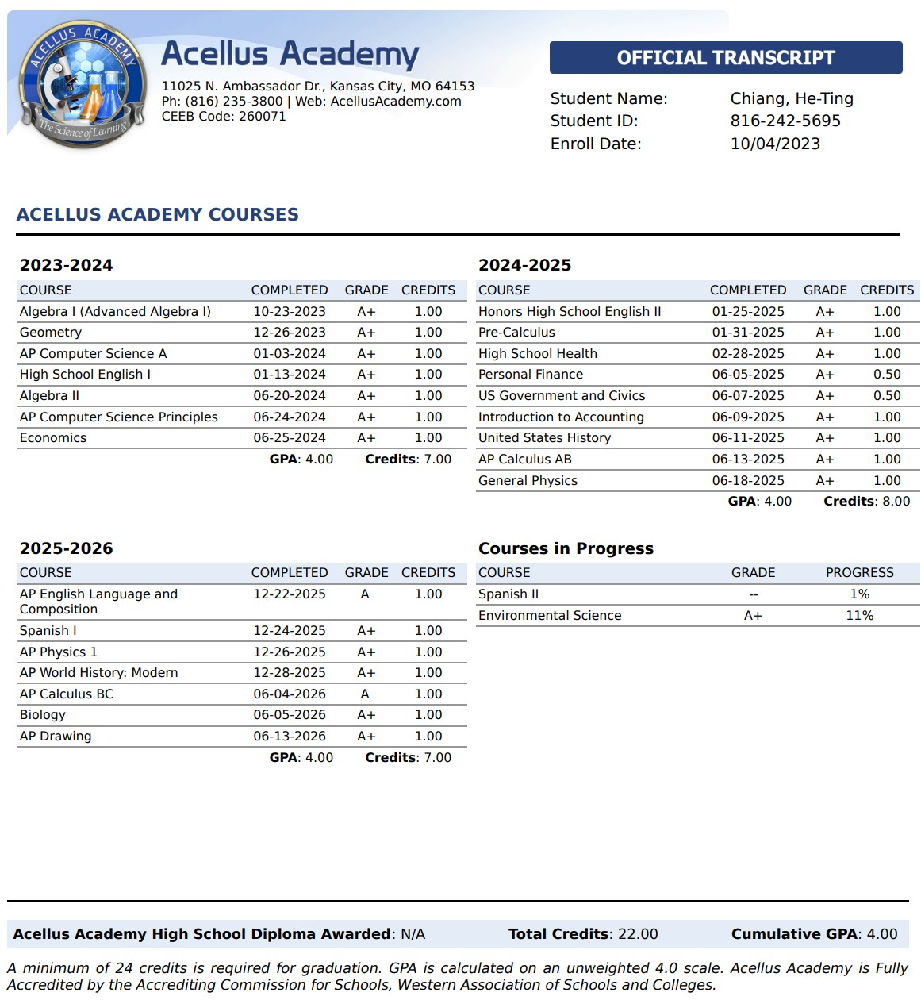
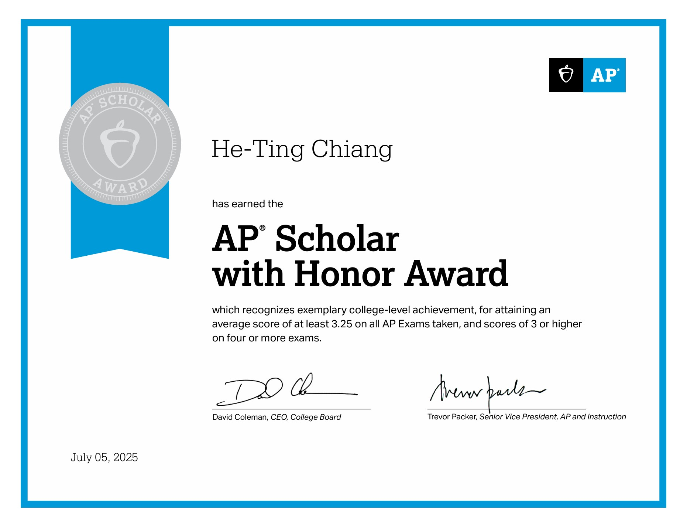
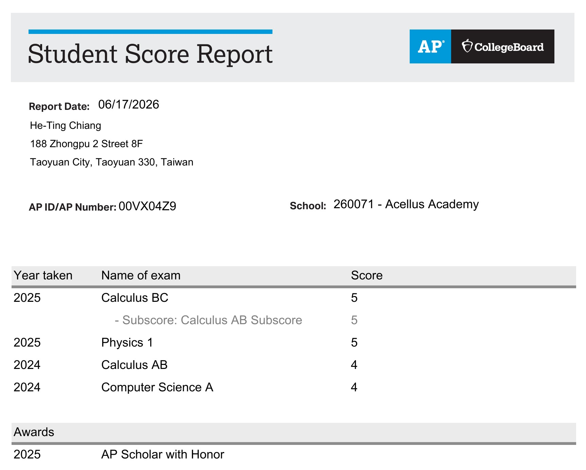

# 學術能力

## Acellus Academy 線上高中

截至目前為止，美國線上高中各科成績皆為 A 或 A+。我以全英文方式修讀美國 Acellus Academy 高中課程，包括數學、物理、化學與人文等學科。所有課程、測驗與論述作業皆以英文進行。這全英語的美國線上高中課程學習經驗，不僅強化了我的語言能力，更使我具備了在國際學術環境中以英文思考與交流的能力。

<!-- -->

## AP Scholar with Honor

2025年高分通過 AP Exams，獲得 AP Scholar with Honor。

- AP Calculus BC：5
- AP Physics 1：5
- AP Calculus AB：4
- AP Computer Science A：4

#  [回到主頁](index.md)

