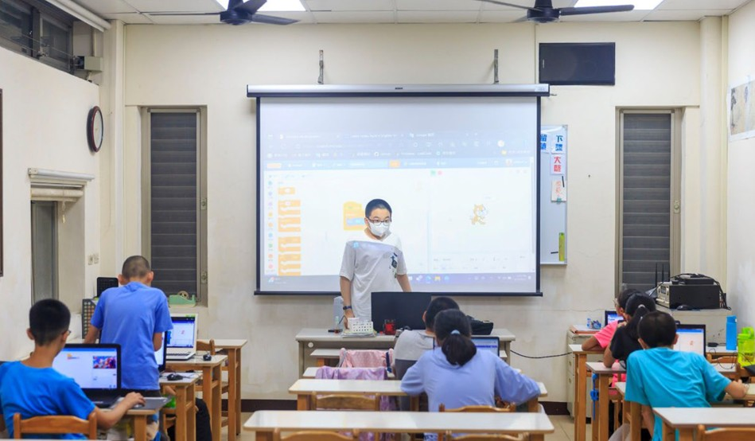
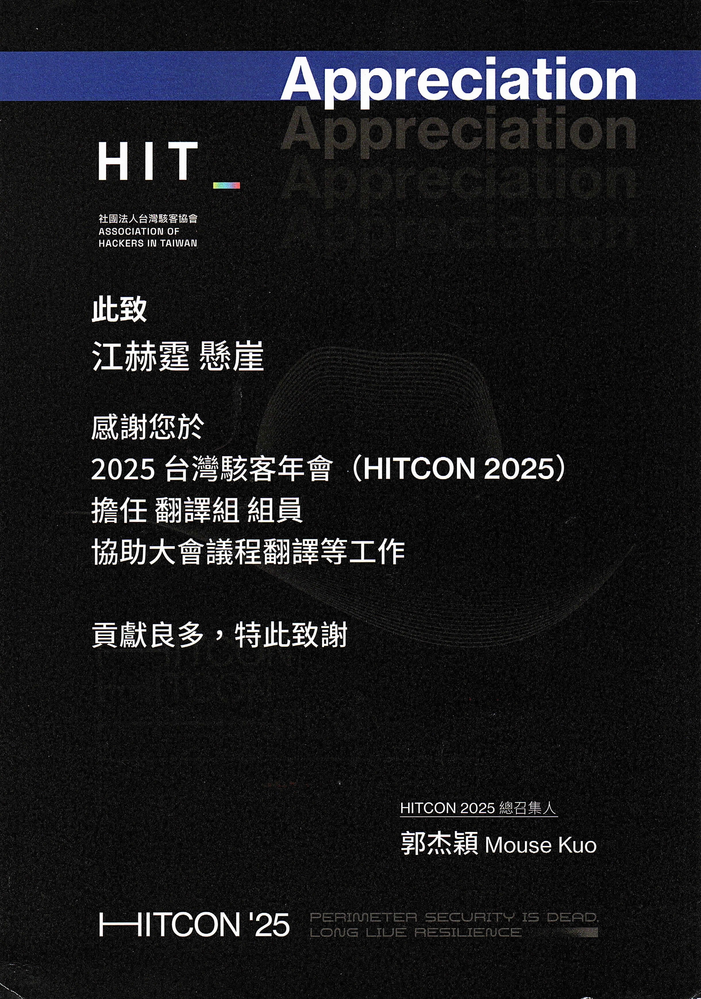
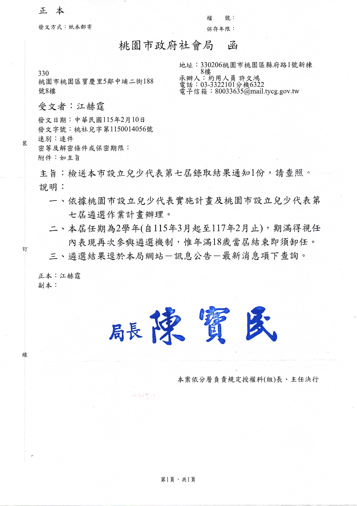
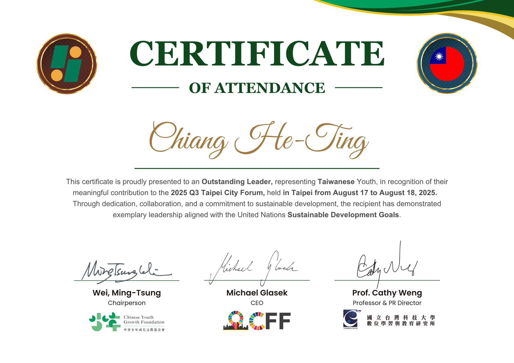
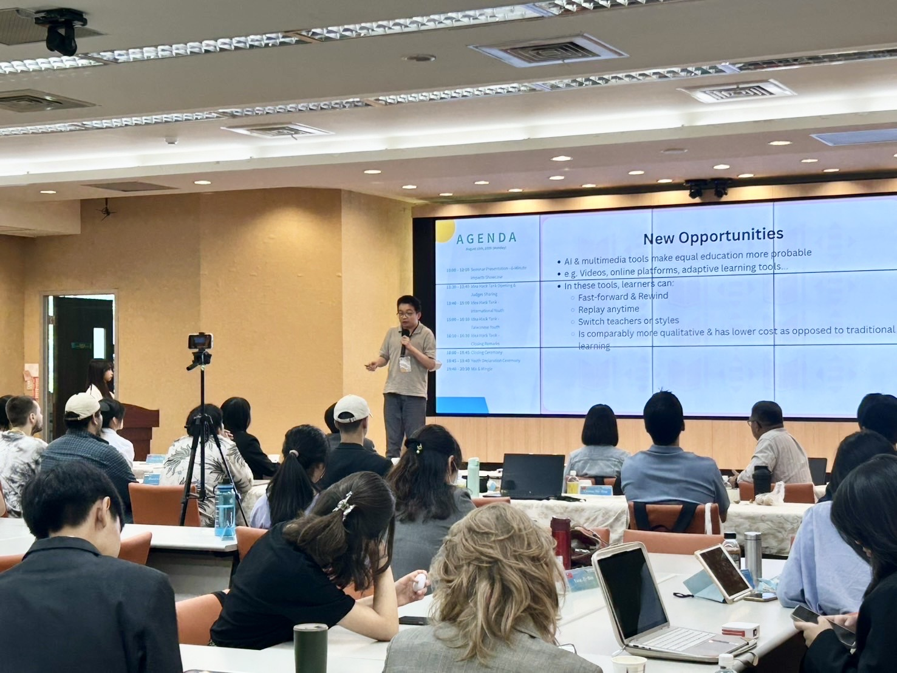

# 社會參與

### 1. Information Technology Instructor Volunteer 

- Since 2023, served as a volunteer instructor teaching programming, artificial intelligence tools, and computational thinking at homeschooling communities and educational organizations.
- Assisted students in developing programming skills and applying AI technologies in learning and project development.

---

### 2. HITCON 2025 Translation Team Volunteer [Certificate](照片/2025HITCON翻譯志工.jpg)

   **2025 台灣駭客年會（HITCON 2025）翻譯組志工**

- Assisted with English–Chinese translation of technical content, conference materials, and international speaker sessions at HITCON 2025.
- Gained exposure to cybersecurity research, vulnerability analysis, penetration testing, and emerging security trends through participation in one of Asia's leading cybersecurity conferences.
- Developed technical translation, documentation, and cross-cultural communication skills.

---

### 3. Taoyuan City Government Youth Representative (7th Term) [Certificate](照片/兒少代表錄取通知.jpg)

**桃園市政府 第七屆兒少代表**

- Selected through a competitive public selection process as a Youth Representative of the Taoyuan City Government.
- Term of Service: March 2026 – February 2028.
- Represent youth perspectives in discussions related to children's rights, education, digital technology, mental health, and public policy.
- Participate in policy discussions, proposal development, and public affairs activities to promote youth engagement in government decision-making.

---

### 4. Outstanding Leader Award – Taipei City Forum 2025 [Certificate](照片/SDGs6分鐘演講.jpg)

**在Taipei City Forum2025 獲頒 Outstanding Leader榮譽證書**

- Represented Taiwanese youth at Taipei City Forum 2025 Q3, delivering a public presentation on topics related to the United Nations Sustainable Development Goals (SDGs).
- Collaborated with youth leaders from diverse backgrounds to discuss sustainability, technology innovation, and global challenges.
- Delivered a six-minute English presentation and was awarded the Outstanding Leader Certificate for leadership, active participation, and cross-cultural collaboration.

---

# [Back to Home](index.md)