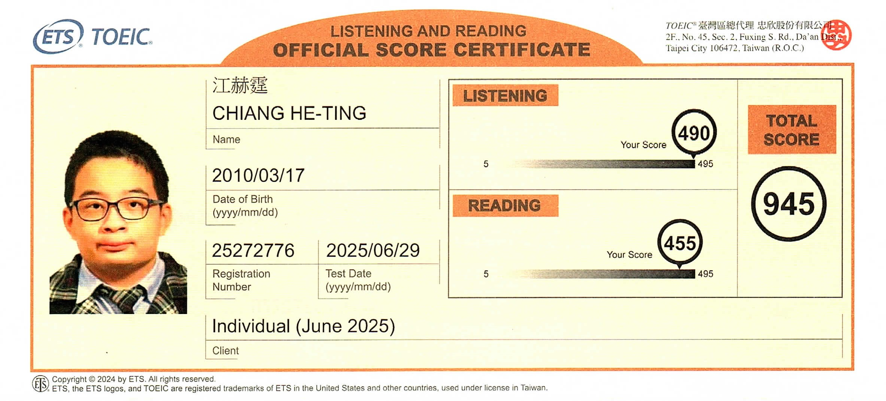
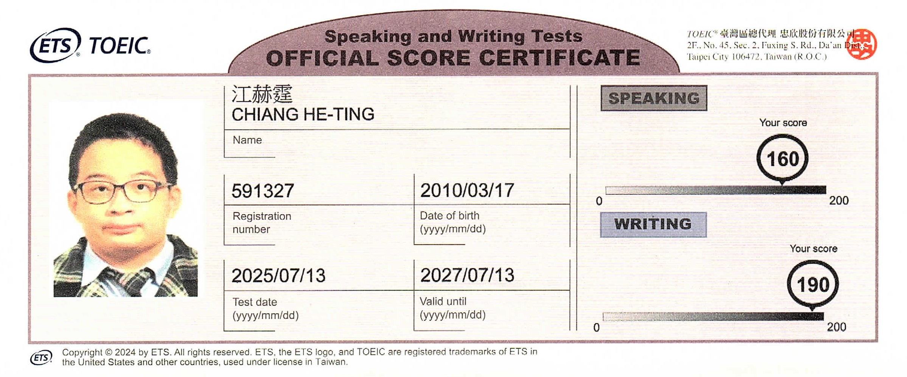
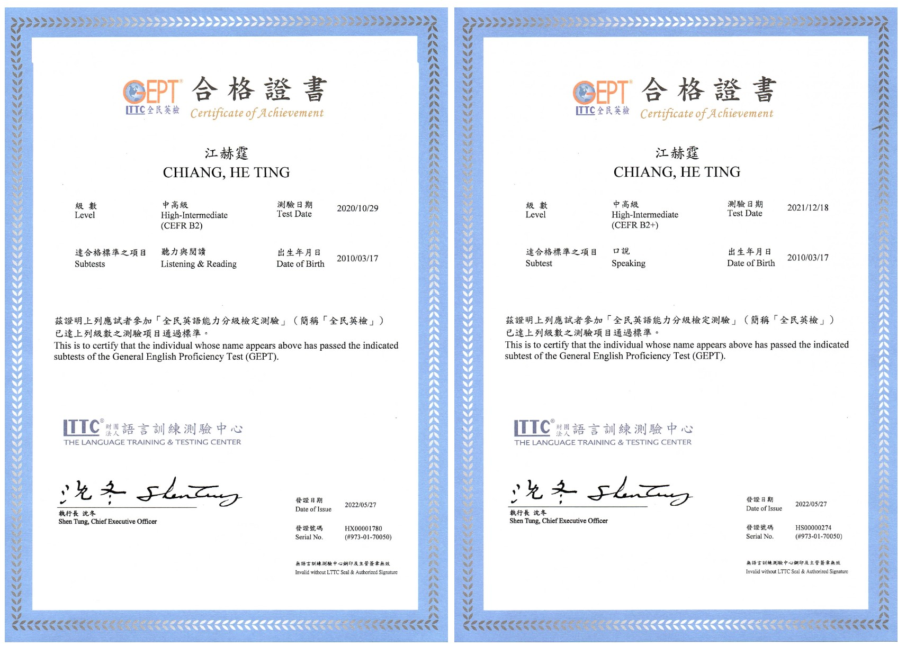
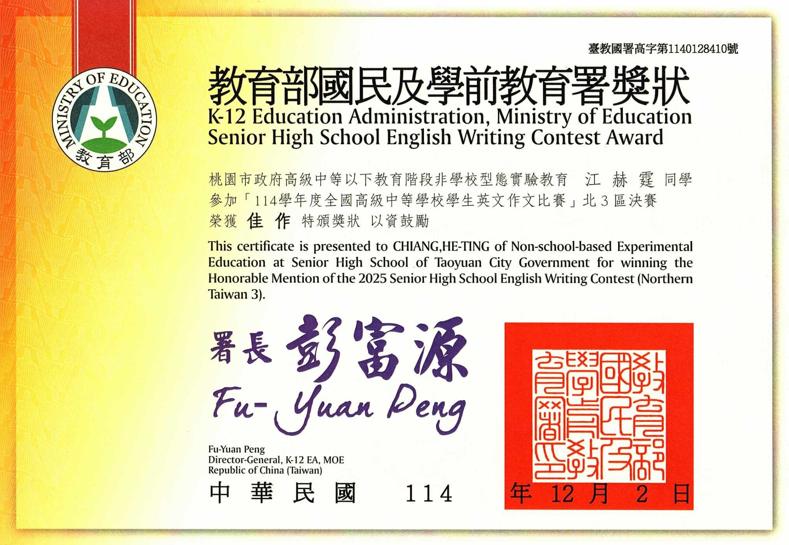
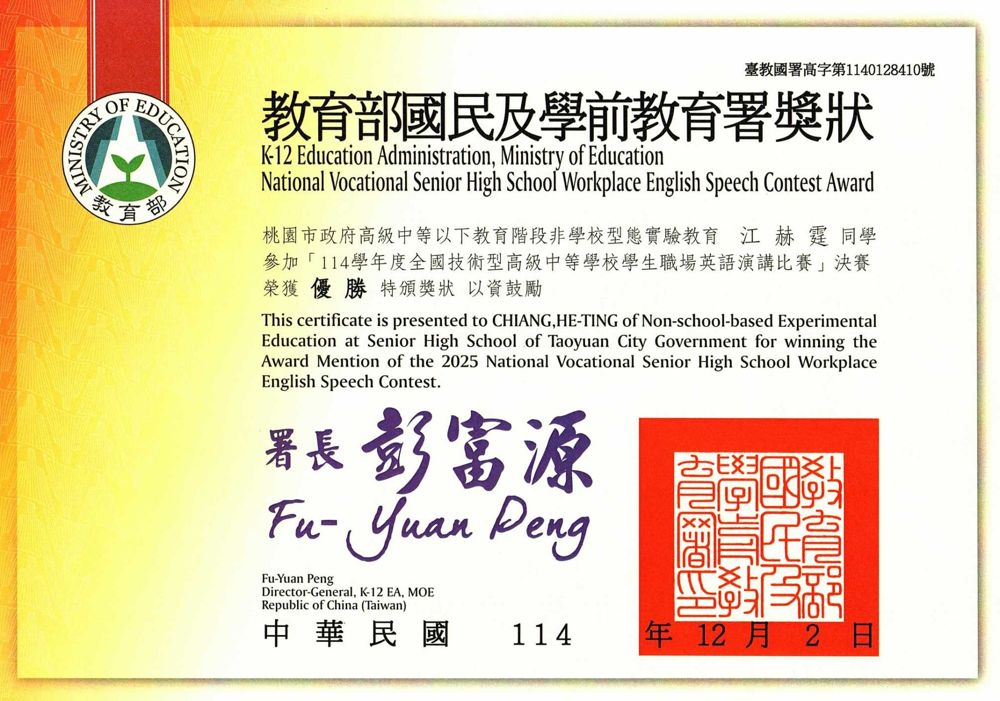

#  語言能力

## 1. TOEIC Listening & Reading

- Score: 945

---

## 2. TOEIC Speaking & Writing

- Speaking: 160
- Writing: 190

---

## 3. GEPT High-Intermediate Level
**全民英檢中高級**

- Passed the High-Intermediate Preliminary Test in Grade 5
- Passed the High-Intermediate Speaking Test in Grade 6

---

## 4. National English Essay Writing Competition

### 全國高級中等學校學生英文作文比賽

- 主辦單位：教育部國民及學前教育署（教育部） 
- 區域：北三區決賽 
- 獎項：佳作（Honorable Mention）

---

## 5. National Vocational High School Workplace English Speech Contest

### 全國技術型高級中等學校學生職場英語演講比賽

- 主辦單位：教育部國民及學前教育署（教育部） 
- 區域：全國決賽 
- 獎項：決賽優勝（Award Winner）

---

# [Back to Home](index.md)