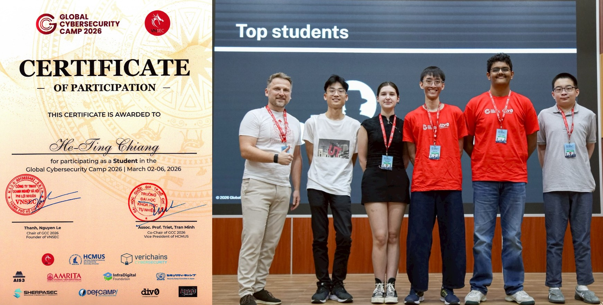
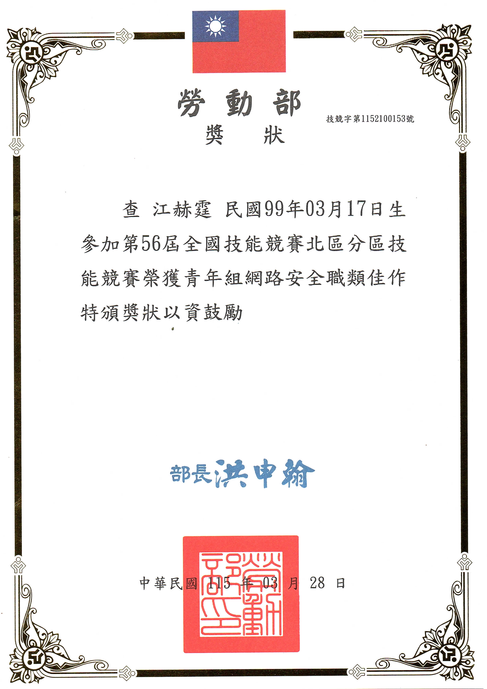
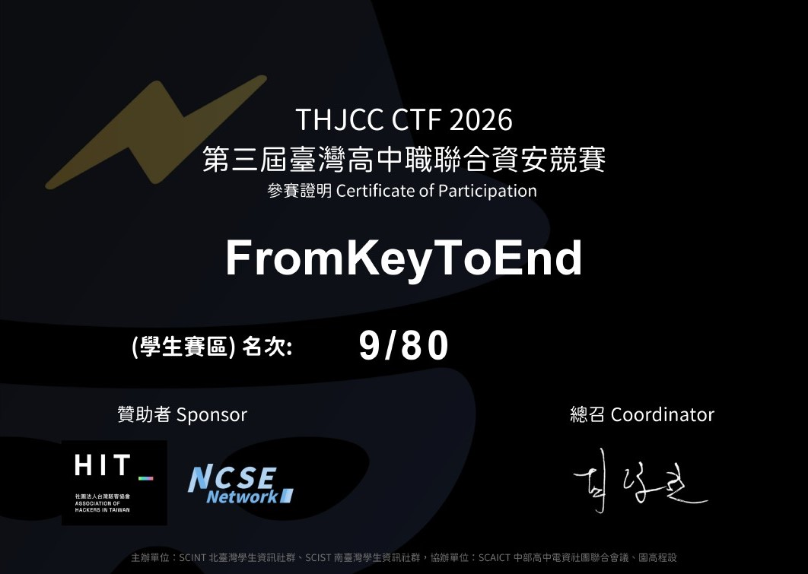
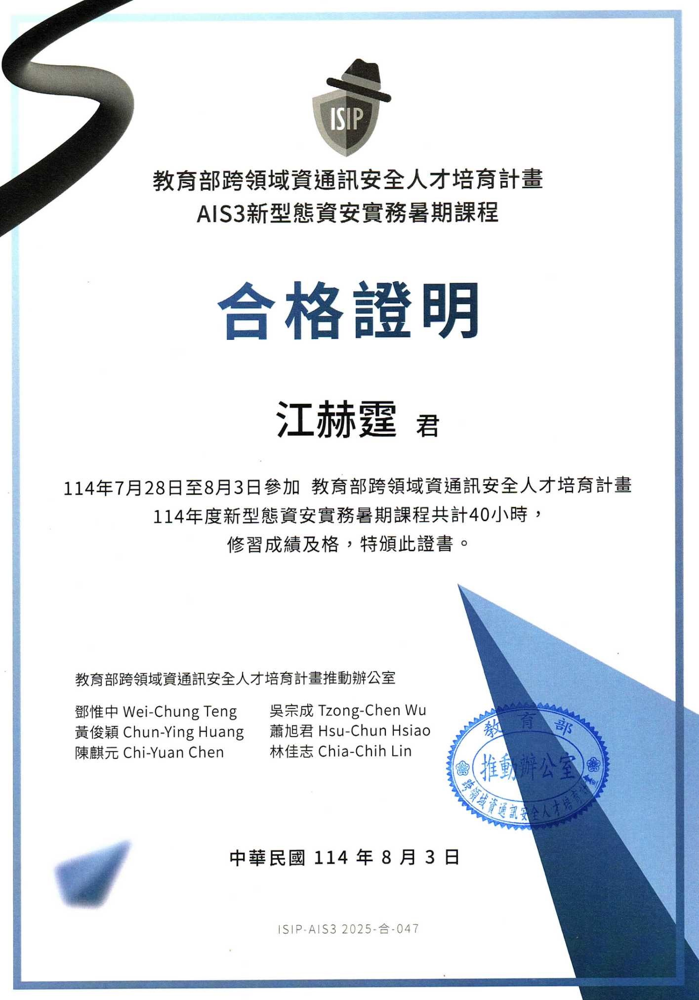
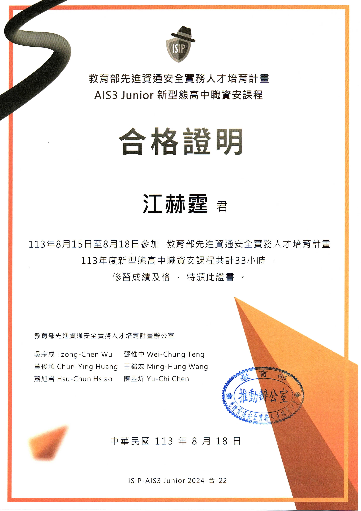
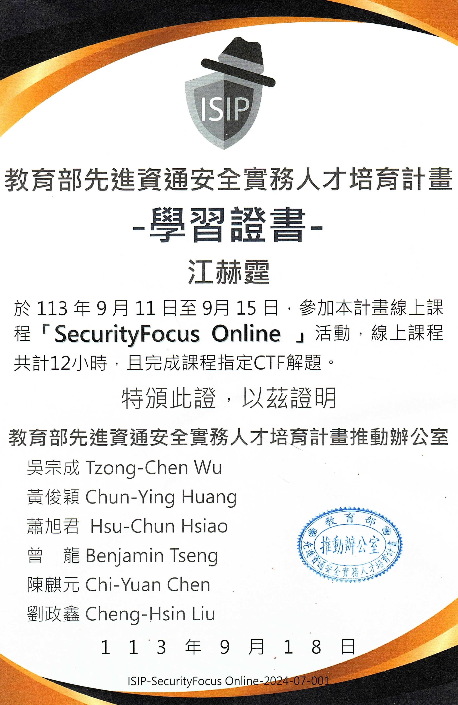
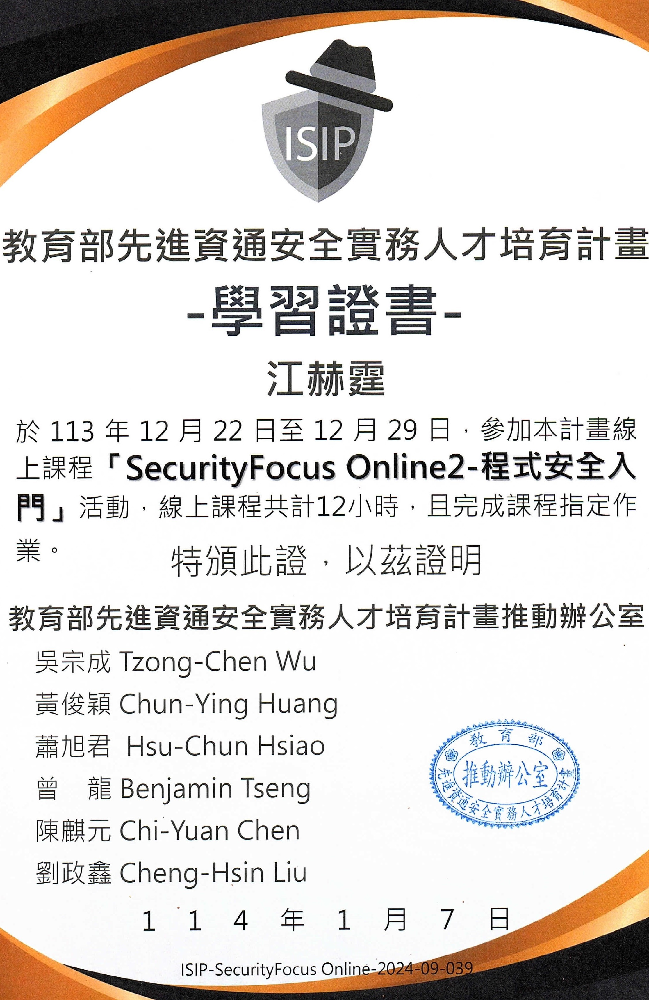
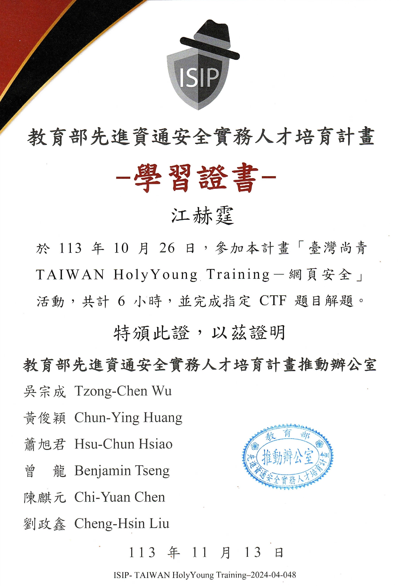
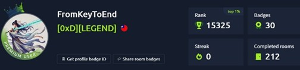

# 資安比賽與活動

- [1. Global Cybersecurity Camp 2026 MVP](#1-global-cybersecurity-camp-2026-mvp)  
- [2. National Skills Competition – Cyber Security (Excellent Award)](#2-national-skills-competition--cyber-security-excellent-award)  
- [3. THJCC CTF 2026](#3-thjcc-ctf-2026)  
- [4. AIS3 Practical Cybersecurity Summer Program](#4-ais3-practical-cybersecurity-summer-program)  
- [5. AIS3 Junior Cybersecurity Training Program](#5-ais3-junior-cybersecurity-training-program)  
- [6. SecurityFocus Online (2024)](#6-securityfocus-online-2024)  
- [7. SecurityFocus Online2 – Programming Security (2025)](#7-securityfocus-online2--programming-security-2025)  
- [8. Taiwan HolyYoung Training – Web Security (2024)](#8-taiwan-holyyoung-training--web-security-2024)  
- [9. TryHackMe](#9-tryhackme)

### 1. Global Cybersecurity Camp 2026 MVP

- Selected by Taiwan Ministry of Education (教育部) as 1 of 5 national representatives.
- Participated in an international cybersecurity camp hosted by University of Science, Vietnam National University Ho Chi Minh City and VNSEC.
- Awarded MVP among participants from multiple countries across Asia.

[Verify Certificate](照片/GCC2026.jpg)

---

### 2. National Skills Competition – Cyber Security (Excellent Award)

**第56屆全國技能競賽北區分區技能競賽 青年組網路安全職類 榮獲佳作**

- Organizer: Ministry of Labor (勞動部)
- Competition covered network security defense, system hardening, vulnerability assessment, penetration testing, digital forensics, and incident response.
- Demonstrated practical cybersecurity, problem-solving, and hands-on technical skills.

[Verify Certificate](照片/第56屆全國技能競賽北區分區技能競賽.jpg)

---

### 3. THJCC CTF 2026

**Taiwan High School Joint Cybersecurity Competition 2026**

**第三屆臺灣高中職聯合資安競賽**

- Ranked 9th among 80 nationwide participants (9/80).
- Solved challenges in Web Security, Cryptography, Reverse Engineering, Forensics, and Binary Exploitation.

[Verify Certificate](照片/第三屆臺灣高中職聯合資安競賽.jpg)

---

### 4. AIS3 Practical Cybersecurity Summer Program

**AIS3 新型態資安實務暑期課程 合格證明**

Ministry of Education Cross-Disciplinary Information Security Talent Development Program (ISIP), Taiwan

- Successfully completed 40 hours of intensive cybersecurity training.
- Covered Web Security, Cryptography, Reverse Engineering, Digital Forensics, Linux, Network Security, and Capture The Flag (CTF).
- Earned a Certificate of Completion through practical hands-on cybersecurity exercises.
- Date: Jul 2025 – Aug 2025.
- AIS3 Pre-Exam: National Rank #9.

[Verify Certificate](照片/AIS3新型態資安實務暑期課程.jpg)

---

### 5. AIS3 Junior Cybersecurity Training Program

**AIS3 Junior 新型態高中職資安課程 合格證明**

Ministry of Education Advanced Information Security Talent Cultivation Program (ISIP)

- Completed the AIS3 Junior Cybersecurity Training Program (33 hours).
- Intensive training in cybersecurity fundamentals, CTF challenges, web security, cryptography, Linux, and network security.
- Successfully passed all course requirements.
- Date: Aug 15–18, 2024.

[Verify Certificate](照片/AIS3Junior.jpg)

---

### 6. SecurityFocus Online (2024)

- Completed 12-hour cybersecurity training program under the Ministry of Education ISIP initiative.
- Solved designated CTF challenges covering practical security concepts.

[Verify Certificate](照片/資安課程結業證書-1.jpg)

---

### 7. SecurityFocus Online2 – Programming Security (2025)

- Completed 12-hour programming security training.
- Learned secure coding principles and completed practical assignments.

[Verify Certificate](照片/資安課程結業證書-3.jpg)

### 8. Taiwan HolyYoung Training – Web Security (2024)

- Completed 6-hour hands-on web security workshop.
- Practiced web vulnerability analysis and CTF-based exercises.

[Verify Certificate](照片/資安課程結業證書-2.jpg)

---

## 9. TryHackMe

- 全球 Top 1%
- LEGEND Rank

