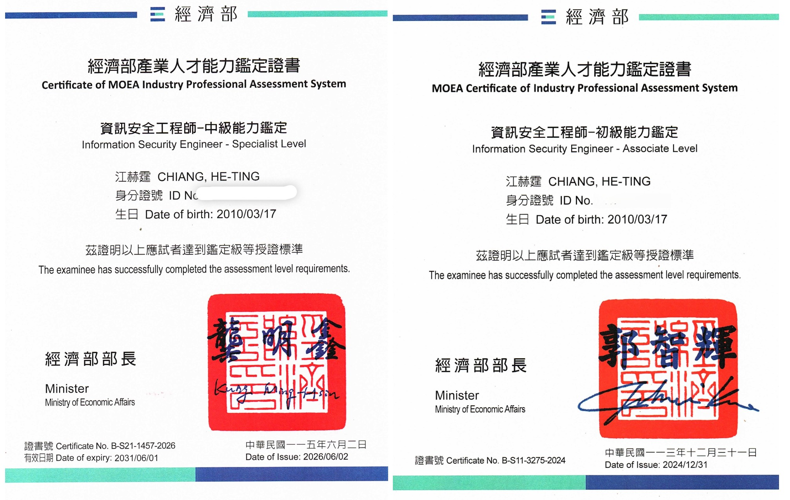
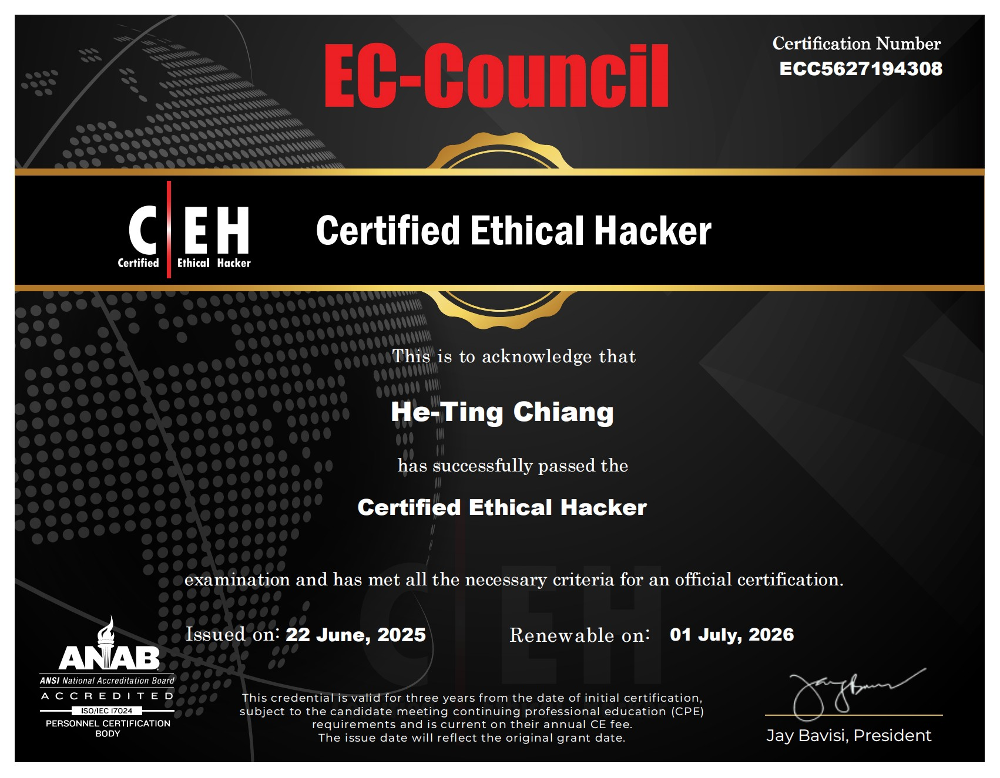
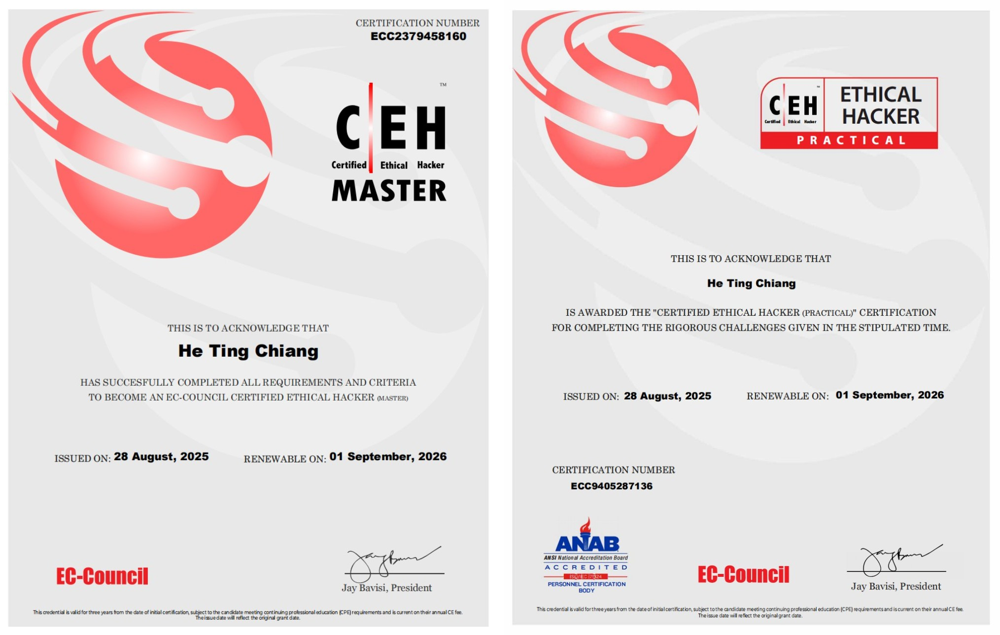
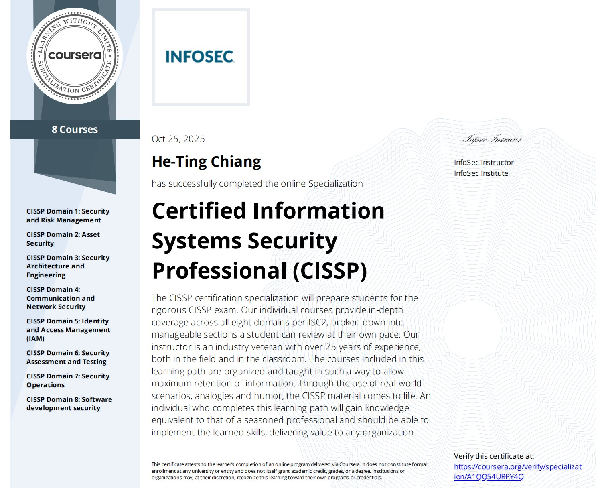

# 資安認證

- [1. iPAS Information Security Engineer (Intermediate & Associate)](#1-ipas-information-security-engineer-intermediate--associate)
- [2. EC-Council Certified Ethical Hacker (CEH), CEH Practical, and CEH Master](#2-ec-council-certified-ethical-hacker-ceh-ceh-practical-and-ceh-master)
- [3. CISSP Specialization](#3-cissp-specialization)
- [4. Microsoft Cybersecurity Analyst Professional Certificate](#4-microsoft-cybersecurity-analyst-professional-certificate)
- [5. Google Cybersecurity Professional Certificate](#5-google-cybersecurity-professional-certificate)
- [6. AI for Cybersecurity Specialization](#6-ai-for-cybersecurity-specialization)

---

### 1. iPAS Information Security Engineer (Intermediate & Associate)
**經濟部產業人才能力鑑定（iPAS） 資訊安全工程師－中級 初級 皆通過**

- Issued by: Ministry of Economic Affairs (Taiwan)
- Certification Date: 2026/06/02
- Valid Until: 2031/06/01
- Level: Intermediate (Specialist Level)
- National Industry Professional Certification

---

### 2. EC-Council Certified Ethical Hacker (CEH), CEH Practical, and CEH Master

- Issued by: EC-Council
- CEH covers penetration testing, network attacks, defensive mechanisms, system security, web security, cryptography, and incident response.
- CEH Practical validates hands-on penetration testing and vulnerability assessment skills.
- Achieved CEH Master status by completing both theoretical and practical certification requirements.

---

### 3. CISSP Specialization

- Issued by: InfoSec Institute
- Studied the eight CISSP domains based on the ISC2 CISSP framework.
- Covered security governance, risk management, security architecture, identity and access management, security testing, security operations, and software security.

[Verify Certificate](https://coursera.org/verify/specialization/A1QQ54URPY4Q)

---

### 4. Microsoft Cybersecurity Analyst Professional Certificate

- Completed Microsoft's professional cybersecurity program.
- Covered network security, operating system security, cloud security, IAM, Microsoft Defender, Azure Active Directory, governance, and compliance.
- Developed enterprise-level threat detection, incident response, and security assessment skills.
- Estimated Learning Time: ~240 Hours

[Verify Certificate](https://coursera.org/verify/professional-cert/HP8HTG5A2Y2H)

---

### 5. Google Cybersecurity Professional Certificate

- Completed Google's professional cybersecurity program.
- Covered Linux, SQL, SIEM, IDS, Incident Response, Security Risk Management, and Python Security Automation.
- Developed practical skills in threat detection, log analysis, and security operations.
- Estimated Learning Time: ~170 Hours

[Verify Certificate](https://coursera.org/verify/professional-cert/488Y5F9LHS1Q)

---

### 6. AI for Cybersecurity Specialization

- Issued by: Johns Hopkins University
- Applied AI and machine learning techniques to cybersecurity problems.
- Covered Threat Detection, Malware Analysis, Network Anomaly Detection, Adversarial Machine Learning, GAN Security, Reinforcement Learning Applications, and AI Model Security.

[Verify Certificate](https://coursera.org/verify/specialization/X7OWHJU6SJL2)